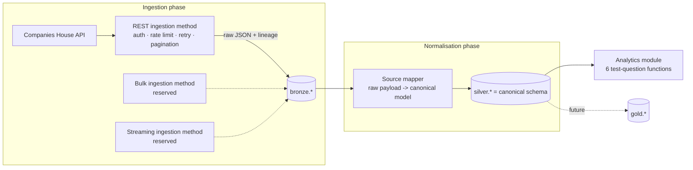

# Architecture

## 1. Purpose

This repo answers the Sonovate Data & Analytics Engineer tech test questions using the
Companies House Public Data API, built as production-shaped code rather than a one-off
script. It is also meant to work as the first slice of a small local data platform: adding
a second data source, or a second way of ingesting an existing source, should mean adding
a module, not restructuring anything.

The six test questions (all in the context of companies matching the search term `sono`)
are the acceptance criteria for the pipeline. See `docs/data-model.md` for how each
question maps onto stored fields.

## 2. Guiding principles

Taken from companies house own documentation and applied throughout:

- **Company number is identity.** Company name is never used as a key.
- **Tolerate schema drift.** Access fields defensively (`.get(...)`), never assert on the
  full set of keys a response "should" have. New fields must not break ingestion.
- **Central plumbing, not per-call logic.** One rate limiter, one retry policy, one
  paginator, reused by every REST call — not reimplemented per source.
- **Nothing is hardcoded that could reasonably be configuration** — rate limits, retry
  behaviour, base URLs, endpoint paths are constructor arguments, not constants buried in
  code. See 6.
- **Keep the raw response.** Every API response is persisted before anything is derived
  from it, so reprocessing after a bug fix or schema change never requires re-hitting the
  API.
- **Never expose the API key** outside the ingestion boundary; it lives in an environment
  variable, sourced from `.env` (untracked) locally and a real secret store in any
  non-local deployment.
- **REST for targeted lookups only.** A `sono` search returns a small result set, well
  inside the 600-requests/5-minutes limit. This design does not attempt to be a
  full-register crawler — that's explicitly what bulk data products and the Streaming API
  are for, per the guide, and is out of scope here (though the ingestion layer is shaped
  so they can be added — see 7.4).

## 3. Two phases: ingestion and normalisation

The platform separates **how data gets in** from **how it's shaped once it's in**, using
three Postgres schemas:

```
bronze   raw, unmodified payloads (JSONB) + retrieval metadata — produced by ingestion
silver   canonical, typed, normalised tables — produced by normalisation
gold     curated/aggregated marts for consumption — schema reserved, not populated yet
```



**Ingestion is organised by *method*, not by source.** Companies House exposes its data
three ways — REST, bulk snapshot, streaming (guide 28) — and a future data source might
arrive via any of those, or something else entirely (a file drop, another vendor's SDK).
Structuring `ingestion/` around *how data is fetched*, with a shared `IngestionMethod`
base class, means the REST plumbing (rate limiting, retry, pagination) is written once and
reused by every REST-based source, and a bulk or streaming source later gets its own base
class alongside REST rather than each source reinventing its own transport handling.
Companies House today only uses the REST method; `bulk/` and `streaming/` are reserved,
documented, empty.

**Normalisation maps raw payloads to a canonical schema.** `silver.*` is not "Companies
House's fields, typed" — it's the platform's own model of a company, address, etc. A
source-specific mapper (`transform/companies_house/normalizer.py`) is responsible for
translating Companies House's raw shape into that canonical model. If a second source
later also describes companies, its mapper targets the same canonical model, and the
`silver` tables don't change.

**Why stop at silver for now:** the test's deliverable is six specific answers, not a
general-purpose reporting surface. Building persisted gold marts and a consumption layer
for a single, fixed set of questions would be scope the task didn't ask for.
`analytics/` reads only from `silver`, through plain function calls, so a future gold
layer is a matter of inserting a materialisation step and repointing consumers, not a
redesign. See [ADR 0002](adr/0002-bronze-silver-gold-layering.md).

**Deliberately deferred:** gold-layer materialisation, any UI/API consumption layer,
bulk/streaming ingestion methods, multi-source conflict resolution in silver,
incremental/ETag-based sync. The architecture is shaped so each of these is an addition,
not a rework.

## 4. Request paths

Two linear phases, each independently runnable and idempotent:

```
1. ingest      REST ingestion method (Companies House) → bronze
2. normalise   bronze → canonical mapping → silver
```

Both are re-runnable without side effects: bronze rows are keyed by
`(source_url, retrieved_at)` and normalisation is a pure read-of-bronze /
upsert-into-silver step keyed by `company_number` (and child natural keys for
one-to-many tables). Re-running either step never duplicates data or requires a fresh API
call.

## 5. Component breakdown

```
src/company_data_platform/
├── core/                            # shared, source-agnostic plumbing
│   ├── http.py                        # requests session wrapper (timeouts, headers)
│   ├── rate_limiter.py                # token bucket, configured by RateLimitConfig
│   ├── retry.py                       # tenacity policy, configured by RetryConfig
│   └── config.py                      # RateLimitConfig, RetryConfig, RestSourceConfig, top-level Settings
├── ingestion/                       # INGESTION PHASE — produces bronze, organised by method
│   ├── base.py                        # IngestionMethod ABC — run(**params) -> persists raw payloads to bronze
│   ├── rest/
│   │   ├── base.py                      # RestIngestionMethod(IngestionMethod) — shared fetch/paginate/persist skeleton
│   │   └── companies_house/
│   │       ├── config.py                  # CompaniesHouseConfig(RestSourceConfig) — base_url, endpoint paths, api_key
│   │       ├── ingestor.py                # CompaniesHouseIngestor(RestIngestionMethod)
│   │       ├── client.py                  # raw calls: search_companies(), get_company() -> dict
│   │       ├── pagination.py              # start_index paginator, concrete to Companies House search today
│   │       ├── auth.py                    # HTTP Basic (key as username, empty password)
│   │       └── exceptions.py              # CompaniesHouseError hierarchy
│   ├── bulk/                          # reserved: future BulkIngestionMethod
│   └── streaming/                     # reserved: future StreamingIngestionMethod
├── transform/                       # NORMALISATION PHASE — bronze -> canonical -> silver
│   ├── base.py                        # Normalizer ABC — read_bronze() -> map_to_canonical() -> upsert_silver()
│   ├── canonical/
│   │   └── company.py                   # CanonicalCompany, CanonicalAddress, CanonicalPreviousName, CanonicalSicCode
│   └── companies_house/
│       └── normalizer.py                # CompaniesHouseNormalizer(Normalizer)
├── storage/
│   ├── db.py                          # engine/session, schema-qualified metadata (future — not built yet)
│   ├── bronze_models.py               # future — not built yet
│   ├── silver_models.py               # future — not built yet
│   └── bronze/
│       └── writer.py                    # file-based bronze writer (current, simplified stand-in for the above)
├── analytics/
│   └── sono_test_answers.py           # the 6 questions, pure functions over silver
├── pipeline.py                        # ingest(query) -> normalise(), parameterised
└── cli.py                             # Typer: `ingest`, `normalise`, `answer`, `run`
```

No `app/`, no API service. The CLI is the only consumer today; see
[ADR 0005](adr/0005-cli-first-no-consumption-layer.md).

`pagination.py` lives under `ingestion/rest/companies_house/`, not `core/`, because it's
written directly against the raw `/search/companies` response shape — it is concrete to
Companies House's `/search/companies` endpoint today, not a generic paginator, since that's
the only paginated endpoint that exists. It would move to `core/` and generalize (e.g. via a
`TypeVar`) once a second paginated endpoint exists; doing so now would be speculative.

As of this slice, `CompaniesHouseClient` and `pagination.py` return/operate on raw
response dicts, not validated Pydantic models — the `schemas.py` tolerant-validation
layer described in earlier drafts of this document has been removed. Validating the raw
JSON shape and mapping it to the canonical model are the same conceptual step (see the
"Canonical Mapping + Validation + Cleansing" stage in
`docs/BDD/companies_house_data_platform_architecture.md`), so a separate raw-schema
layer between fetch and canonical mapping was pure duplication once nothing else
consumed it. Bronze — not a Pydantic model — is what preserves raw fidelity now: the
untouched `response.json()` dict is written straight to `storage/bronze/` by
`storage/bronze/writer.py`, a file-based store that is a deliberate simplification of the
Postgres-backed bronze design in `docs/data-model.md` for this first ingestion slice.

## 6. Configuration

Every tunable — rate limit, retry behaviour, timeouts, base URL, endpoint paths — is a
constructor argument sourced from a typed config object, not a hardcoded constant or a
module-level environment read scattered through the code. This is what makes `core/` and
`ingestion/` usable as a library, not a script wired to one deployment. See
[ADR 0004](adr/0004-config-as-dependency-injection.md).

- **`core/config.py`** defines the generic, source-agnostic shapes: `RateLimitConfig`
  (`max_requests`, `period_seconds`, `max_concurrency`), `RetryConfig` (`max_attempts`,
  backoff base/max, jitter, which HTTP statuses are retryable), and `RestSourceConfig`
  (`base_url`, `timeout_seconds`, `default_items_per_page`, plus a nested
  `RateLimitConfig` and `RetryConfig`). It also defines the top-level `Settings`
  (pydantic-settings `BaseSettings`), which reads environment variables / `.env` and
  assembles the per-source configs.
- **`ingestion/rest/companies_house/config.py`** defines `CompaniesHouseConfig`, extending
  `RestSourceConfig` with what's specific to this source: the base URL default, the
  endpoint paths (`search_companies_path`, `company_profile_path`, ...) as fields rather
  than string literals inline in the client, and the API key (`SecretStr`, sourced from
  `COMPANIES_HOUSE_API_KEY`).
- **Clients and ingestion methods take a config object in their constructor** —
  `CompaniesHouseClient(config: CompaniesHouseConfig, session=None)` — rather than reading
  globals or environment variables directly inside business logic. Practical effect: unit
  tests construct a `CompaniesHouseConfig` pointed at a mock server with a tiny rate limit
  and no backoff delay, without touching real settings or sleeping; a future deployment
  can raise or lower the rate limit, point at a different base URL (e.g. a sandbox), or
  change an endpoint path, purely through configuration — no code change.
- Environment variables map onto nested config via a delimiter (e.g.
  `COMPANIES_HOUSE__RATE_LIMIT__MAX_REQUESTS=600`), documented in `.env.example`.
- The same pattern is the convention future sources follow — a `<Source>Config` extending
  the relevant method base config, injected rather than imported.
- In practice, `CompaniesHouseConfig` currently loads its own environment directly via
  `pydantic-settings` rather than being assembled by a top-level `Settings` aggregator —
  there's only one source today, so the aggregator described above is a future addition
  once a second source exists, not something built yet.

## 7. Ingestion phase design

### 7.1 `IngestionMethod` base class

The contract every ingestion method fulfils, regardless of transport:

- takes method-specific parameters (e.g. a search query, a file path, a stream cursor)
- fetches raw data from the outside world
- persists it into `bronze`, tagged with `source`, `source_url` (or equivalent),
  `retrieved_at`
- returns a summary (record count, duration, errors) for logging/observability

Nothing in this base class assumes HTTP, pagination, or any transport detail — those
belong to the method-specific subclasses.

### 7.2 REST ingestion method

`RestIngestionMethod(IngestionMethod)` adds what every REST-based source needs: an HTTP
session (`core/http.py`), the shared rate limiter, the shared retry policy, and the
generic paginator — each constructed from the config object described in 6. A concrete
REST source (e.g. Companies House) implements *what* to call and in what order; it does
not reimplement *how* to paginate, retry, or rate-limit.

### 7.3 Companies House (the first concrete source)

- **Auth:** HTTP Basic, API key as username, empty password (guide 4). Read once from
  config, never logged.
- **Rate limiting:** the shared token bucket, configured (by default) for 600 requests /
  5 minutes with a safety margin, applied to every call this process makes — not
  per-worker, not per-key (guide 5). Overridable via config, e.g. for faster tests.
- **Retry:** the shared `tenacity` policy — exponential backoff with jitter, retrying
  `429` and transient `5xx`/network errors only; `400/401/404/422/406` are not retried
  (guide 33).
- **Pagination:** the shared `items_per_page`/`start_index` paginator, used for
  `/search/companies` (guide 7). The alphabetical/dissolved-search variant
  (`search_above`/`search_below`) is documented but not implemented — not required by any
  of the six questions.
- **Versioning:** no explicit `Accept` header, which resolves to the latest resource
  version (guide 26).
- **Errors:** normalised into a `CompaniesHouseError` hierarchy (`AuthenticationError`,
  `ValidationError`, `NotFoundError`, `RateLimitError`, `ServerError`), matching guide 6.

### 7.4 Bulk and streaming (reserved, not built)

`ingestion/bulk/` and `ingestion/streaming/` are empty today but reserved for:

- **`BulkIngestionMethod`** — download and load a snapshot product (e.g. Companies
  House's monthly company data product), for initial large-scale loads (guide 28).
- **`StreamingIngestionMethod`** — hold a long-lived connection, checkpoint the last
  processed timepoint, and apply incremental changes (guide 29).

Both would sit alongside `RestIngestionMethod` under the same `IngestionMethod` contract
and write into the same `bronze` schema, so normalisation doesn't need to know which
ingestion method produced a given bronze row.

## 8. Ingestion → normalisation flow (for this task)

```
1. GET /search/companies?q=sono&items_per_page=100&start_index=...   (paginate to end)
   → bronze.ch_search_result   (one row per page, raw JSON + retrieved_at)
2. for each company_number found:
   GET /company/{company_number}
   → bronze.ch_company_profile  (one row per company, raw JSON + etag + retrieved_at)
3. CompaniesHouseNormalizer maps bronze.ch_company_profile →
   CanonicalCompany / CanonicalAddress / CanonicalPreviousName / CanonicalSicCode
   → upserted into silver.company, silver.company_previous_name, silver.company_sic,
     silver.company_address
```

Search results already carry most fields needed (status, type, dates, address), but the
profile call is still made per company: it's the authoritative resource per the guide
(9), the "sono" result set is small, and having full profiles in bronze is what makes
this project a usable foundation rather than a single-purpose script.

## 9. Testing strategy

- **TDD (unit):** `core/` (rate limiter, retry, paginator) and
  `transform/companies_house/normalizer.py` are built test-first against mocked HTTP
  (`responses`) and recorded fixture payloads in `tests/fixtures/`. No test hits the real
  API. Config-as-dependency-injection (6) is what makes this practical — tests build
  small, fast configs instead of monkeypatching constants.
- **BDD (acceptance):** `tests/features/` holds one Gherkin scenario per test question,
  run with `pytest-bdd`, executed against fixture data run through the real
  ingest→normalise pipeline (fixture HTTP, real Postgres via a test container). This is
  literally the six questions as executable acceptance criteria.
- **Edge cases covered** (from guide 38, trimmed to what's relevant here): dissolved
  company with a cessation date, company with multiple previous names, company with
  multiple SIC codes, `limited-partnership` company type, company with a partial/short
  address (missing optional fields), zero-result search, multi-page search result.
- **Live integration tests** exist separately, gated behind `--run-live` and a real API
  key, and are never run by default or in CI.

## 10. Containerisation & dev experience

```
docker-compose.yml     postgres  +  app (build from Dockerfile, runs the CLI)
Dockerfile              multi-stage: poetry install → slim runtime image
alembic/                schema migrations for bronze/silver (and gold, reserved)
.env.example            COMPANIES_HOUSE_API_KEY, DATABASE_URL, ...
```

`docker compose up -d db && docker compose run --rm app python -m company_data_platform.cli run --query sono`
is the entire "install and use" path — no local Python environment required. A local
(non-Docker) dev path via Poetry is documented in the README for running tests quickly.

## 11. Extensibility

Two independent extension points, matching the two-phase design:

**A new ingestion method** (e.g. bulk snapshots): subclass `IngestionMethod` (or extend
`bulk/base.py` once it exists), reusing `core/` where transport concerns overlap (e.g. a
bulk download still benefits from shared retry). No change to `transform/`, `storage/`,
or the CLI structure required.

**A new source using an existing method** (e.g. another REST-based company registry):
add `ingestion/rest/<name>/` (config, client, auth, schemas, exceptions) subclassing
`RestIngestionMethod`, and `transform/<name>/normalizer.py` mapping its raw shape onto the
existing canonical models where the entity genuinely overlaps (e.g. another source of
`CanonicalCompany`), or new canonical models where it doesn't. Silver rows carry
`source_system` for lineage regardless.

Neither path requires changes to `core/` or to unrelated sources.

## 12. Repo layout

```
SonovateTechTest/
├── docker-compose.yml
├── Dockerfile
├── pyproject.toml
├── .env.example
├── alembic.ini
├── migrations/
├── src/company_data_platform/
│   ├── core/
│   ├── ingestion/
│   │   ├── base.py
│   │   ├── rest/
│   │   │   ├── base.py
│   │   │   └── companies_house/
│   │   ├── bulk/
│   │   └── streaming/
│   ├── transform/
│   │   ├── base.py
│   │   ├── canonical/
│   │   └── companies_house/
│   ├── storage/
│   ├── analytics/
│   ├── pipeline.py
│   └── cli.py
├── tests/
│   ├── unit/
│   ├── features/
│   ├── fixtures/
│   └── conftest.py
├── docs/
│   ├── architecture.md
│   ├── data-model.md
│   └── adr/
├── ANSWERS.md
└── README.md
```
